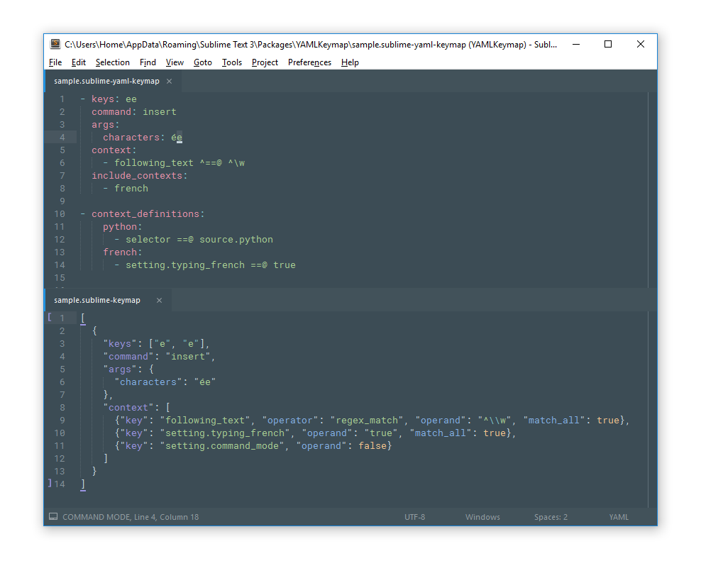

# YAMLKeymap

YAMLKeymap is a little package that allows you to write your keybindings in YAML!

Furthermore, it propose a much more user-friendly context syntax, it allows you to re-use contexts and, by default, it adds the `settings.command_mode == false` context to every keybinding as the [unofficial docs recommend][]!

Have a look:



Looks good?

## Usage

*Documentation coming soon...*


## Installation

Because it is not available on package control for now, you have to add this repo "manually" to your list.

### Using package control

1. Open up the command palette (`ctrl+shift+p`), and find `Package Control: Add Repository`. Then enter the URL of this repo: `https://github.com/math2001/YAMLKeymap` in the input field.
2. Open up the command palette again and find `Package Control: Install Package`, and just search for `YAMLKeymap`. (just a normal install)

### Using the command line

```bash
cd "%APPDATA%\Sublime Text 3\Packages"             # on window
cd ~/Library/Application\ Support/Sublime\ Text\ 3 # on mac
cd ~/.config/sublime-text-3                        # on linux

git clone "https://github.com/math2001/YAMLKeymap"
```

> Which solution do I choose?

It depends of your needs:

- If you intend to just use YAMLKeymap, then pick the first solution (Package Control), **you'll get automatic update**.
- On the opposite side, if you want to tweak it, use the second solution. Note that, to get updates, you'll have to `git pull`


[unofficial docs recommend]: http://docs.sublimetext.info/en/latest/reference/key_bindings.html?highlight=keymaps#command-mode